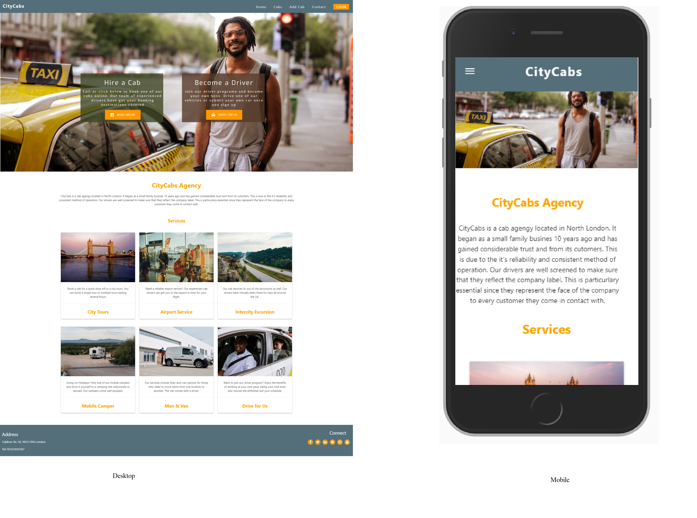

# CityCabs Agency

<a href="https://cab-agency.herokuapp.com/">View the live project here</a>

  
CityCabs Agency is a small but reliable cab service. The project is inspired by the cabby service concept. Users can book cabs 
for different destinations nationwide. 

There's also opportunity for new drivers to join the company by signing up and adding their vehicles part of the collection. Services range from city tours, to out of town escurtions, from airport service to camper vans for those who wish to go aay on holidays.
we try to put some emphasis in our drivers who join our company. That way, set forth our reputation as being a reputable company.
The site contains basic information for anyone who wants to book a cab or drive for a cab agency and be their own boss.

## User Experience (UX)

This project is for anyone who may need to book a cab for different servces.  

The site is comprised of five main sections. Each of these section is made up of sub sctions which are the pages for the website.
These consists primarily of Cab, Brands, Types, Users and Admin sections.

The Home page contains information about the services on offer.
The navigation bar contains the following links:
Cabs - here users can see all availabe cabs which they can click and book.
Add Cab - New drivers can upload cab information and their details directly using this link.
Log In -  registered users can login to the cab agency
Contact - new users can request more information or sign up registeration here . 

For consistency of user experience the site's logo, navigation links and social
media links on the page footer are repeated across the site's pages. The design and layout is also consistent when viewed on desktop, tablet or mobile
devices. The use of Materialize enables the site elements to rearrange themselves according to the current browser screen width in use.

- As a user I want to book a cab for a particular destination or a city tour
- By registering as a member, I can submit or add my on vehicle to the collection a d drive for CityCabs.

- As a user I want to be able to visit or discover new and interesting destinations
  - As a user I want to book a cab for a destinations based on the services on the home page
  - As a user I want to be recommended services based on my requests.
  
- As a user I want to register to a website that gives me the opportunity to work as a cab driver and add my own vehicle 
  - As a user  i want to be able to add a specific vehicle type and brand 
  - As a user I want to able to explore a variety of added vehicles

- As a user I want to be able to create an experience by actually taking part in a driver program
  - As a user I want to be recommended administrative options to add and edit cabs entries
  - As a user I want to be able to browse through the cars 
  
- Link to Mockups 
  - static/assets/mockup/MS3 Mockup.pdf  

- website
  - https://cab-agency.herokuapp.com/

## Features

The website is made up of 23 pages. 
-Navigation:
  -The website is easy to navigate through the various pages. The navigation is fixed to the top and is consistent on all web pages.
- Visuals: 
  -The pictures are inserted into materialize cards clear and properly described
- Cabs page:
  -Users can use the cabs link to view all available cabs.
  -Users can search for a cab randomly using the search form
- Add Cab page:
  -Users can add cabs directly. Users cannot change the vehicle, brand or model type. 
  -They're offered a selction to choose from.  
- Contact page:
  -News users can request for more information or admin access in order to modify cab entries.
- Log In page:
  -Registered users can log in. Once logged in, they get a flash message informing them with their username when thy're logged in.
  -They get a welcome message with a link to the admin section.
- Register page:
  -New users can use this link to register for membership.
- Admin:
  -The admin section offers three options
- Add Type:
  -Users can add a vehicle type. Vehicle types include Sedan, Station Wagon, Van, etc.
- Add Brand:
  -Users can add a vehicle brand. Vehicle brands include Fiat, Nissan, Renault, etc.
- Add Cab:
  -Users can add a cab. Their admin privileges give them the options to add a type, brand or model of their choice.
  -The added cab gets diplayed on the cabs page among existing cabs.
- MongoDB:
  -Users can store their selection in the database. The database has records for cabs, types, brands, models and users. 
- Responsiveness:
  -The website is developed with the notion of mobile-first and is thus, fully reponsible.
- The website is intuitive and the content is relevant 
-Social Media icons
  -These extend the site's functonality. Users can visit a social media website by clicking onthe appropriate icon  
  
### Existing Features

- Cabs page- User can browse through and choose between different vehicle types and models. 
- Add Booking page- User can book a cab by filling in their information ans slecting a cab. 
- Log in form- A registered user can log in to the admin section 
- Sign up form- A user can sign up fo a free membership by filling in the form on the sign up page.
- Contact Page- User can contact the company directly via this form. Their request send an email to the compnay using EmailJs
- Search form- Users can search for available or booked cabs 
- MongoDB- Users records are stored in the database. cab pictures can be added via url links and inserted in the template on cabs page

### Features left to implement

At the moment the site lacks email confirmation. Users have to call or email the driver using their contact information on the cabs page. 
Confirmation is given to the users via phone. 

## Technology used
This projet is built using HTML, CSS, Javascript, jQuery and Materialize

- HTML 
  - Html is used the defacto language for the web pages
  - Link: https://www.w3schools.com/html/default.asp
  
- CSS
  - CSS is implemented for styling and layout.
  - Link: https://www.w3schools.com/css/default.asp
    
- Materialize
  - Bootstrap is to make this website responsive and mobile-first websites. Theframework includes HTML and CSS based design templates to help design websites faster and easier. It The Header, Body and Footer are all in Bootstrap containers which creates a very responsive effect on the entire website.
    Link: https://materializecss.com/
  
- MongoDB
  -This is the Database used to store users, vehicle types, models and bookings
  - Link: https://www.mongodb.com/

- jQuery
  - https://jquery.com/
  
- EmailJs
  - https://www.emailjs.com/

- Git
  - Git was used for version control by utilizing the Gitpod terminal to commit to Git and Push to GitHub.

- Google Fonts:
  - Google fonts were used to import the 'Titillium Web' font into the style.css file which is used on all pages throughout the project.
  - https://fonts.google.com/

- Font Awesome:
   - Font Awesome was used on all pages throughout the website to add icons for aesthetic and UX purposes.
   - https://fontawesome.com/

- GitHub:
  - GitHub is used to store the projects code after being pushed from Git.
  - https://github.com/ 

- Heroku
  - https://www.heroku.com

## Testing

1. Site Navigation:
   1. from home page navigate to the other pages on the website. The links work as intended.
   2. clicking on the logo brings you to the home page.

2. Home Page:
   1. click on the Hire a Cab. It takes you to the Book a Cab page. 
   2. Click on Become a Driver. It takes you to the Contact Page where you can become a member      

3. Cover text(Hire a Cab and Become a Driver):
   1. Open this website on mobile version. This content is set to hide on small screens less than 763px

4. Cabs Page:
   1. Go to Cabs page. Enter a vehicle type or model in the search box. Click search or cancel to stop the search. The results are displayed   in a separate page.
   
5. Add Cab Page:
   1. Fill in the form. You can only choose from the given vehicle types, brands and models in the drop-down options
   2. Fill your information and add a url link for a picture of the cab. Click on Book it. It takes you to the "Cabs Page"

5. View Bookings Page:
   1. Go to "View Bookings" page. Enter a vehicle type or model in the search box. Click search or cancel to stop the search. The results       are displayed in a separate page.
        
6. Register Form:
   1. Only accessible from the admin Dashboad page. New users have to request explicitely to have access to this page .
   2. Submit empty form and verify that an error message about the required fields appears
   3. Submit the form with an invalid email and see a message asking you to fill the information in the required fields 
   4. Try to submit a form with password shorter than 5 characters or longer than 15 characters. You get an error message
   5. Try to submit a form by clicking on the Log In link. It take you to the Log In page where you can log in if you already have an account

7. Log In Form:
   1. Go to the "Log In" page. Log in or click on "Request Account" if you haven't yet got an account
    
8. Profile Page:
   1. It is only visible when you log in. It displays a welcome message with the username in session. Click on the "Log out" link. 
   2. It brings you back to the profile page and displays a flash message that user is logged out

9. Contact Form:
   1. Go to the "Contact" page. Send your message or "Request Account" if you haven't yet got an account

10. Social Media icons:
   1. Go to the footer section at the bottom of each page
   2. Try clicking on any social icons. They each open in separate tabs 
 
11. Tablets and mobiles:
    1. The website is optimized for mobile viewing. The media queries display the pages correctly.
    2. Try running the page in mobile mode and see how it correctly fits to the size of the screen 
  

## Deployment

The code consist of interactive website developed using HTML, CSS Javascript, jQuery and Materialize and Python Flask. This code does not contain any executable file. The website is hosted using Heroku. This can be located via:
   - Settings tab on the app page in Heroku 
   - click "Open app" on the top right corner of the page
   - This will open the app in a new page and reveal the project url in Heroku.

## Credits

### Content

- Code for the cards on the home page was taken and edited from:
  - https://materializecss.com/cards.html
  
- The code for the forms was taken and edited from:
  - https://materializecss.com/
  
- The code for the Flask Log In was taken from:
  - https://github.com/TravelTimN/flask-task-manager-project/tree/master/templates 
  
### Media  

- The images were taken from the royalty free website at:
  - https://www.pexels.com/search/eating/ 
  - https://unsplash.com/

### Pagination

  - Pagination example taken from: https://github.com/DarilliGames/flaskpaginate/blob/master/app.py

### Authentication and Login section 
  - Example code from https://github.com/TravelTimN/flask-task-manager-project
  
### Acknowledgements
- I received inspiration for this project from the private cab companies.
